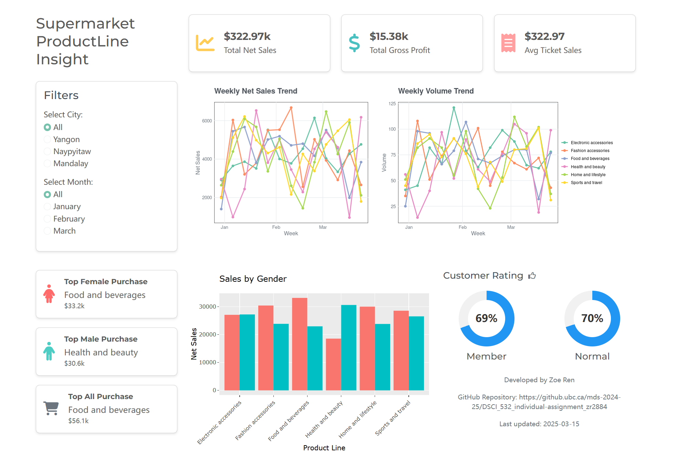

# Supermarket ProductLine Insight

## Contributor

Zoe Ren

## Motivation

**Target Audience**: Retail Business Analysts and Store Managers

Understanding sales performance across different product lines is crucial for developing effective business strategies and improving profitability. This dashboard provides a straightforward view of supermarket sales, including key metrics such as net sales, gross profit, customer purchase behavior, and sales trends over time.

To address the challenge of managing diverse product categories and customer segments, the dashboard allows users to filter data by city and month, offering deeper insights into regional and seasonal variations. It also presents gender-based purchasing trends (via an interactive chart) and customer ratings, helping businesses tailor marketing strategies and enhance the customer experience.

By integrating interactive charts, filters, and key performance indicators (KPIs), this tool empowers stakeholders to visually compare and analyze data, ensuring that businesses can make data-driven decisions efficiently, leading to better resource allocation and increased revenue.

## App description

Deployed in shinyapps.io 👉 <https://zr2884.shinyapps.io/Supermarket-ProductLine-Insight/>



From Instructor Daniel, deploying via shinyapps.io means there is no need to record a video. Here is a brief introduction to this dashboard and an explanation of the Challenging tasks.

The **two filters on the left** serve as **inputs**, controlling all other **outputs**. You can freely switch them to observe how the data changes. The **Sales by Gender** graph is an **interactive** **chart**. You can hover over different bars to see details through the tooltip.

### **Challenging Tasks:**

-   [x] Deploy your dashboard publicly on the web.

-   [x] Add additional inputs/outputs( more than six).

-   [x] Add advanced callback functionality

    -   Based on the selected filters, the **three sales cards at the top** dynamically calculate the **sum or average** values.

    -   Based on the selected filters, the **Sales by Gender** graph slices and sorts the data to determine the **top-purchased product cards**, and also calculate the sum.

    -   Based on the selected filters, the **Customer Rating** graph calculates the **average rating**, converting it from a 10-point scale to a 100-point scale.

## Installation instruction

### Step 1: Set Up the Environment

Ensure that all necessary dependencies are installed by setting up the environment:

```{bash}
conda env create -f environment.yaml
conda activate PL-insight
```

### Step 2: Run the Dashboard

Run the Shiny Dashboard:

```{bash}
Rscript src/app.R
```

**Click the link** beginning with <http://127.0.0.1>

This will launch the interactive web dashboard **Supermarket ProductLine Insight**.
